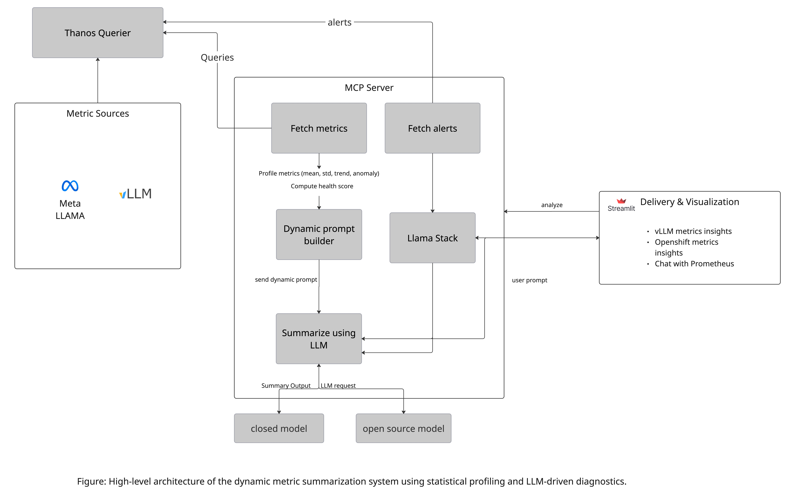
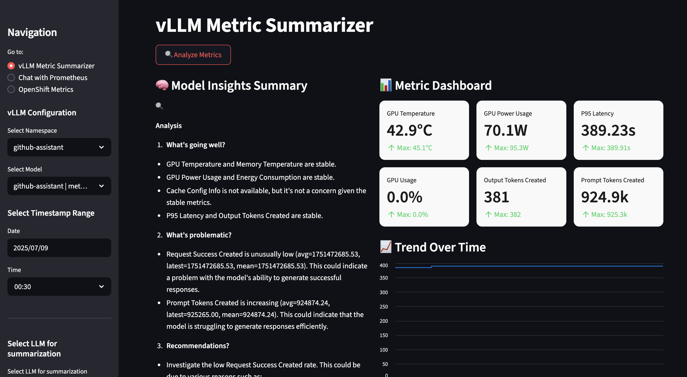
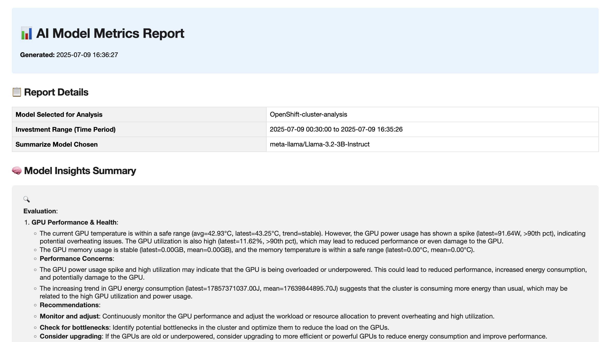

# AI Observability Metrics Summarizer


[Design Document](https://docs.google.com/document/d/1bXBCL4fbPlRqQxwhGX1p12CS_E6-9oOyFnYSpbQskyI/edit?usp=sharing)

This application provides an interactive multi-dashboard interface to **analyze AI model performance metrics and OpenShift cluster metrics** collected from Prometheus and generate **human-like summaries using LLM models** deployed on OpenShift AI.

It helps teams **monitor vLLM deployments, OpenShift fleet health, and GPU utilization** with **actionable AI-powered insights** — all automatically.

---

## Features

### **1. vLLM Monitoring**
- Visualize core vLLM metrics (GPU usage, latency, request volume, etc.)
- Dynamic DCGM GPU metrics discovery (temperature, power, memory)
- Real-time performance analysis and anomaly detection

### **2. OpenShift Fleet Monitoring** 
- Cluster-wide and namespace-scoped metric analysis
- GPU & Accelerators fleet monitoring with comprehensive DCGM metrics
- Workloads, Storage, Networking, and Application Services monitoring
- Enhanced unit formatting (°C, Watts, GB, MB/s, etc.)

### **3. AI-Powered Insights**
- Generate summaries using fine-tuned Llama models
- Chat with an MLOps assistant based on real metrics
- Support for both internal and external LLM models

### **4. Report Generation**
- Export analysis as HTML, PDF, or Markdown reports
- Time-series charts and metric visualizations
- Automated metric calculations and trend analysis

### **5. Alerting & Notifications**
- Set up alerts for vLLM models and OpenShift metrics  
- Slack notifications when alerts are triggered
- Custom alert thresholds and conditions

---

## GPU Monitoring

### **DCGM Metrics Support**
Automatically discovers and monitors:
- **Temperature**: GPU core and memory temperature (°C)
- **Power**: Real-time power consumption (Watts)  
- **Memory**: GPU memory usage (GB) and utilization (%)
- **Energy**: Total energy consumption (Joules)
- **Performance**: GPU utilization, clock speeds (MHz)

### **Fleet View**
Monitor GPU health across your entire OpenShift cluster:
- Cluster-wide GPU temperature averaging
- Power consumption trends
- Memory usage patterns
- Vendor/model detection and inventory

---

## Architecture

### **Core backend components**
- **llm-service**: LLM inference services (Llama models)
- **llama-stack**: LlamaStack backend API
- **vLLM**: vLLM fronts the model and makes metrics available at the /metrics endpoint which Prometheus can coveniently scrape.

### **Monitoring Stack**
- **Prometheus**: Prometheus scrapes the /metrics endpoint offered by vLLM. It can store metrics itself in its own time-series database on a local disk which is
                  highly optimized for fast queries on recent data. This is perfect for real-time monitoring and alerting but is not
                  ideal for long term and multi-year storage. This is where Thanos Querier comes in.
- **Thanos Querier**: Extends Prometheus by solving the problem of long-term retention. Thanos is capable of taking data blocks that Prometheus saves to
                      its local disk and uploading them to inexpensive and durable object storage, like Amazon S3, Google Cloud Storage, or Azure Blob Storage.
                      Querier gives you a cost-effective way of retaining years of metrics data available for historical analysis and trend reporting.
                      Querier sidecars run alongside your Prometheus servers, providing access to real-time and recent metrics.                  
- **DCGM**: GPU monitoring and telemetry
- **Streamlit UI**: Multi-dashboard interface (vLLM, OpenShift, Chat)
- **MCP (Metric Collection & Processing)**: Backend API for metric analysis
- **Report Generator**: PDF/HTML/Markdown export capabilities



### **Key Components**
1. **vLLM Dashboard**: Monitor model performance, GPU usage, latency
2. **OpenShift Dashboard**: Fleet monitoring with cluster-wide and namespace views
3. **Chat Interface**: Interactive Q&A with metrics-aware AI assistant
4. **Report Generator**: Automated analysis reports in multiple formats

---

## Prerequisites

- OpenShift cluster with **GPU nodes** (for DCGM metrics)
- `oc` CLI configured with cluster-admin permissions
- `helm` v3.x installed
- `yq` for YAML processing
- **Prometheus/Thanos** deployed for metrics collection
- **DCGM exporter** for GPU monitoring (optional but recommended)
- [Slack Webhook URL](https://api.slack.com/messaging/webhooks) (for alerting)

---

## Installation

Use the included `Makefile` to install everything:

```bash
brew install yq
```

```bash
cd deploy/helm
```

### Install the AI Summarizer
```
make install NAMESPACE=your-namespace LLM=llama-3-2-3b-instruct
```

### With GPU tolerations
```
make install NAMESPACE=your-namespace LLM=llama-3-2-3b-instruct LLM_TOLERATION="nvidia.com/gpu"
```

### Multiple models with safety
```
make install NAMESPACE=your-namespace \
  LLM=llama-3-2-3b-instruct LLM_TOLERATION="nvidia.com/gpu" \
  SAFETY=llama-guard-3-8b SAFETY_TOLERATION="nvidia.com/gpu"
```

### With alerting
```
make install NAMESPACE=your-namespace ALERTS=TRUE
```

This deploys:
- **llm-service** - LLM inference 
- **llama-stack** - Backend API
- **pgvector** - Vector database
- **metric-mcp** - Metrics collection & processing API
- **metric-ui** - Multi-dashboard Streamlit interface

Navigate to your **Openshift Cluster --> Networking --> Route** and you should be able to see the route for your application.

On terminal you can access the route with -

```bash
oc get route

NAME              HOST/PORT                                                               PATH   SERVICES        PORT   TERMINATION     WILDCARD
metric-ui-route   metric-ui-route-llama-1.apps.tsisodia-spark.2vn8.p1.openshiftapps.com          metric-ui-svc   8501   edge/Redirect   None
```

### Openshift Summarizer Dashboard 


### vLLM SUmmarizer Dashboard 


### Chat with Prometheus 


### Report Generated 



To uninstall:

```bash
make uninstall NAMESPACE=metric-summarizer
```

---

## Using the App

### **Multi-Dashboard Interface**
Access via the OpenShift route: `oc get route ui`

#### **vLLM Metric Summarizer**
1. Select your AI model and namespace
2. Choose time range for analysis  
3. Click **Analyze Metrics** for AI-powered insights
4. Download reports in HTML/PDF/Markdown format

#### **OpenShift Metrics Dashboard**
1. Choose metric category (Fleet Overview, GPU & Accelerators, etc.)
2. Select scope: Cluster-wide or Namespace-scoped
3. Analyze performance with AI-generated summaries
4. Monitor GPU temperature, power usage, and utilization across fleet

#### **Chat with Prometheus**
1. Ask natural language questions about your metrics
2. Get specific PromQL queries and insights
3. Interactive troubleshooting with metrics context

#### **Key Monitoring Categories**
- **Fleet Overview**: Pods, CPU, Memory, GPU temperature
- **GPU & Accelerators**: Temperature, power, utilization, memory (GB)  
- **Workloads & Pods**: Container metrics, restarts, failures
- **Storage & Networking**: I/O rates, network throughput
- **Application Services**: HTTP metrics, endpoints, errors

#### Generate Reports
You can generate detailed metric reports in multiple formats directly from the dashboard:

- **HTML Report**: Interactive and visually rich, suitable for sharing or archiving.
- **PDF Report**: Print-ready, ideal for documentation or compliance needs.
- **Markdown Report**: Lightweight, easy to edit or integrate into wikis and documentation.

To generate a report:
1. Complete your analysis in either the vLLM or OpenShift dashboard.
2. Click the **Download Report** button.
3. Choose your preferred format (HTML, PDF, or Markdown).
4. The report will be generated and downloaded automatically, containing charts, summaries, and key insights from your session.

---

## Local Development via Port-Forwarding

In order to develop locally faster on the MCP/UI you can leverage port-forwarding to llamastack, model and thanos. 
Pre-requisites: you have a deployment on the cluster already.

### Using script
To perform local setup using the `./scripts/local-dev.sh` script, perform the following steps:
1. **Make sure you are logged into the cluster and can execute `oc` commands against the cluster.**
1. Install `uv` by following instructions on the [uv website](https://github.com/astral-sh/uv)
1. Sync up the environment using the following command:
   * `uv sync`

      The `uv sync` command performs the following tasks:

      1. Find or download an appropriate Python version
      1. Creates a virtual environment in `.venv` folder
      1. Build complete dependency using `pyproject.toml` (and `uv.lock`) file(s)
      1. Sync up project dependencies in the virtual environment
1. Activate the virtual environment using the following command:
   * `source .venv/bin/activate`
1. Export the namespace where the kickstart is deployed by running the following command:
   * `export LLM_NAMESPACE=<DESIRED_NAMESPACE>`
1. Run the script by executing the following command:
   * `./scripts/local-dev.sh`

      This script should perform the tasks shown in the following image:


### Manual setup
1. Port-Forward to llamastack, model & thanos:
    1. `oc port-forward pod/llamastack 8321`
    1. `oc port-forward pod/model 8080`
    1. `oc port-forward pod/thanos-querier 9090 -n openshift-monitoring`
1. If testing mcp, navigate to mcp/ and run -- `python3 -m uvicorn mcp:app --host 0.0.0.0 --port 8000 --reload` and you can use curl commands to test the apis
   1. Configure **MODEL_CONFIG** env variable `export MODEL_CONFIG='{"meta-llama/Llama-3.2-3B-Instruct":{"external":false,"requiresApiKey":false,"serviceName":"llama-3-2-3b-instruct"},"openai/gpt-4o-mini":{"external":true,"requiresApiKey":true,"serviceName":null,"provider":"openai","apiUrl":"https://api.openai.com/v1/chat/completions","modelName":"gpt-4o-mini", "cost": {"prompt_rate": 0.00000015, "output_rate": 0.0000006}}}'`
   2. This may change, see `deploy/helm/Makefile` for the latest version. 
1. And then to test the ui, navigate to ui/ and run -- `streamlit run ui.py`

#### Macos weasyprint install

In order to run the mcp locally you'll need to install weasyprint:
1. Install via brew `brew install weasyprint`
2. Ensure installation `weasyprint --version`
3. Set **DYLD_FALLBACK_LIBRARY_PATH** `export DYLD_FALLBACK_LIBRARY_PATH=/opt/homebrew/lib:$DYLD_FALLBACK_LIBRARY_PATH`

---

## Powered By

- [OpenShift AI](https://www.redhat.com/en/technologies/cloud-computing/openshift/openshift-ai)
- [Prometheus](https://prometheus.io/)
- [Streamlit](https://streamlit.io/)

---

## Feedback & Contributions

We welcome contributions and feedback!  
Please open issues or submit PRs to improve this dashboard or expand model compatibility.

---
